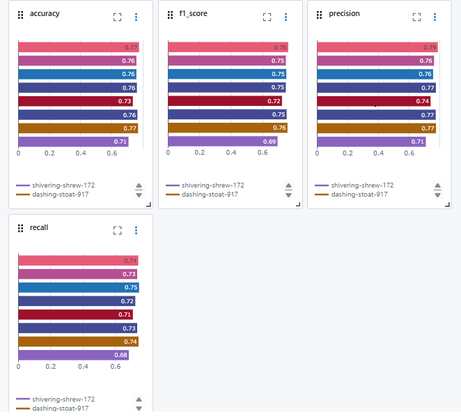

# Bank Customer Churn Prediction





- [X] 1. Fork this Repo [https://github.com/Heba-Atef99/MLOps-Course-Labs]
- [X] 2. Switch to research branch
```bash
git clone https://github.com/youssefhusain/MLOps-Course-Labs.git
cd MLOps-Course-Labs
git checkout research```
- [X] 3. Create a new conda/venvenv, named churn_prediction (python version 3.12) & install the requirements
```bash
   python3.12 -m venv churn_prediction 
   .\churn_prediction \Scripts\activate
   pip install -r requirements.txt```
- [X] 4. Download the CSV dataset file into data folder
- [X] 5. Add the Mlflow logging in the src/train.py file
- [X] 6. Run the experiment by running the following command in the MLOps-Course-Labs directory
- [X] 7. python src/train.py
- [X] 8. Try another model or any other changes you think might improve the performance
- [X] 9. Run at least two other different experiments
- [ ] 10.Filter your experiments and register two chosen models one in staging and the other in production, you’ll need to justify your
choice :D
- [ ] 11.BONUS: Complete the readme file in the research branch.
EXTRA BONUS: Make the code cleaner, e.g., break the code into modules, add logging, .. etc


واجبك
تم تعيينه
التعليقات الخاصة
